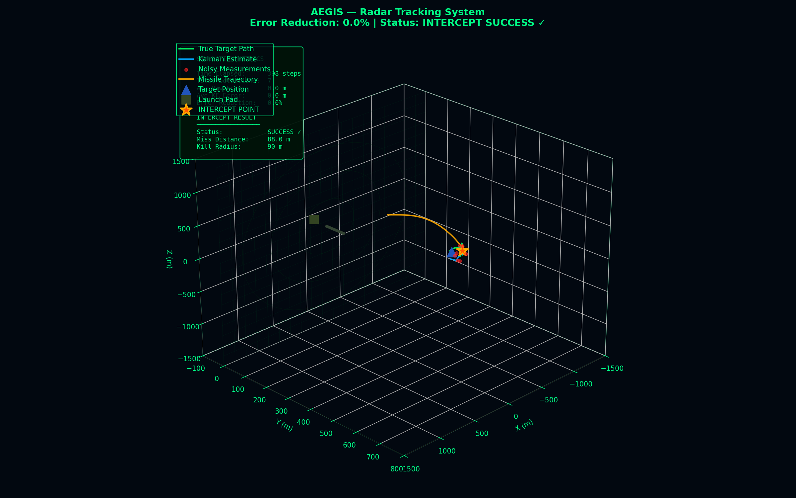
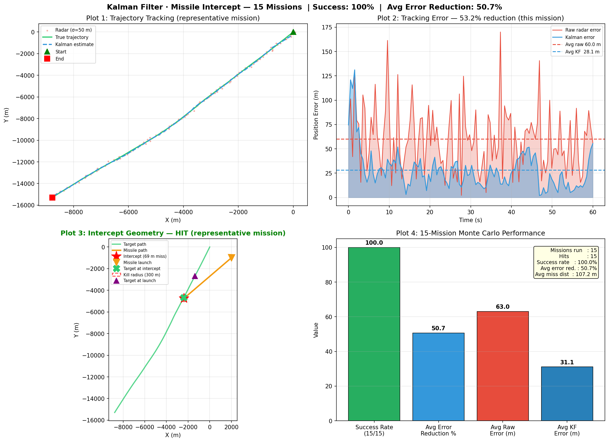

<h1>AEGIS &mdash; Radar Target Tracking &amp; Interception Simulator</h1>

<b>Recursive Bayesian state estimation applied to a noisy radar tracking and guidance problem.</b> 
<i>A linear Kalman filter, a Monte-Carlo evaluation harness and a real-time 3-D simulator &mdash; written from first principles in NumPy.</i>

<b>Success rate 100% (15/15) &nbsp;&middot;&nbsp; mean position error 63.0 m &rarr; 31.1 m (&minus;50.7%) &nbsp;&middot;&nbsp; mean miss distance 107.2 m</b>

---

## Table of contents

1. [Overview](#1-overview)
2. [What is implemented](#2-what-is-implemented)
3. [Visual results](#3-visual-results)
4. [Repository layout](#4-repository-layout)
5. [Quickstart](#5-quickstart)
6. [Method](#6-method)
7. [Experimental setup](#7-experimental-setup)
8. [Results and validation](#8-results-and-validation)
9. [Implementation notes](#9-implementation-notes)
10. [Limitations and roadmap](#10-limitations-and-roadmap)
11. [Reproducibility](#11-reproducibility)
12. [Report and slides](#12-report-and-slides)
13. [References](#13-references)
14. [Citation](#14-citation)
15. [Author](#15-author)
16. [License](#16-license)

---

## 1. Overview

A radar does not observe a target &mdash; it observes a *noisy, partial* projection of it. Position returns are corrupted by measurement noise, velocity is never measured directly, and the target manoeuvres unpredictably between pulses. Any decision that depends on *where the target will be* must therefore be built on top of an estimator.

This repository implements that complete pipeline end to end:

~~~text
target kinematics  -->  sensor model  -->  Kalman filter  -->  predictive intercept solver  -->  Monte-Carlo evaluation
     (truth)          (noise, partial)      (fuse + smooth)        (feasibility search)          (statistics)
~~~

Two complementary artefacts are provided from the same underlying model:

| | Purpose |
|---|---|
| **Analytical study** (` [kalman_missile_sim.py](kalman_missile_sim.py)) | 2-D, batch, headless. Runs 15 independent Monte-Carlo missions and produces a four-panel quantitative figure plus a console report. This is the artefact that produces the numbers. |
| **Real-time simulator** (` [radar_3d_sim.py](radar_3d_sim.py), [radar_3d_demo_equations_v2.html](radar_3d_demo_equations_v2.html)) | 6-state 3-D filter running live at 60 FPS inside a custom software 3-D renderer, with a tactical HUD, live error telemetry and an on-screen overlay of the exact equations being executed. This is the artefact that makes the mathematics legible. |

**Everything is written from scratch.** No `filterpy`, no `pykalman`, no game engine, no scene graph: the filter, the process-noise discretisation, the pinhole camera, the look-at basis, the projection pipeline and the particle system are all implemented directly, so every symbol in the report maps to a line of code. The only third-party dependencies are NumPy, Matplotlib and Pygame.

### Scope and intent

This is an academic **estimation and control** project. The engagement is the standard textbook target-tracking benchmark: abstract point masses with kinematic constraints, synthetic Gaussian sensor noise and invented parameters. It contains no real sensor data, no hardware model and no aerodynamic, propulsion or guidance-system modelling. The transferable contribution is the estimator and the evaluation methodology &mdash; the same nearly-constant-velocity filter and the same Monte-Carlo protocol underpin multi-object tracking in autonomous driving, visual object tracking, robot localisation and any sensor-fusion stack.

---

## 2. What is implemented

| Component | Details |
|---|---|
| **Motion model** | Nearly-constant-velocity (NCV) with stochastic acceleration; random initial heading per mission; speed-envelope and altitude-hold constraints in the 3-D variant |
| **Sensor model** | Additive Gaussian position noise; anisotropic in 3-D (horizontal 45 m vs. altimetric 18 m) to reflect the different physics of range/azimuth and elevation accuracy |
| **Estimator** | Discrete-time linear Kalman filter, derived and implemented in full: predict, innovation, gain, correct, covariance update. 4 states in 2-D, 6 states in 3-D |
| **Process noise** | Analytically discretised continuous white-noise-acceleration model, giving the exact dt^4/4, dt^3/2, dt^2 block structure rather than a hand-tuned diagonal |
| **Intercept solver** | Forward feasibility search over the predicted trajectory for the *earliest* reachable rendezvous point under a constant-speed interceptor constraint |
| **Guidance** | Receding-horizon lead prediction with exponentially smoothed re-targeting, re-solved on every filter update |
| **Evaluation** | 15-mission Monte Carlo; success rate, mean miss distance, and mean error reduction vs. the raw sensor baseline |
| **Visualisation** | Four-panel Matplotlib report; plus a hand-written 3-D engine (look-at camera, pinhole projection, vectorised batch projection, depth culling, range rings, radar pulse rings, particle detonation, animated equation overlay) |
| **Engineering** | Zero-dependency browser build, pinned requirements, MIT licence, CI (compile + headless regression run + artefact upload), machine-readable citation metadata |

---

## 3. Visual results

### 3.1 Real-time 3-D simulator

  

Green: true trajectory. Red: raw radar returns. Blue: Kalman estimate. Amber: interceptor. The HUD reports live raw-vs-filtered error and the resulting error reduction; the left-hand panel types out the equation currently driving the simulation.

### 3.2 Monte-Carlo analysis

  

**Panel 1** trajectory tracking &mdash; truth, returns and estimate. **Panel 2** instantaneous position error of the raw sensor vs. the filter over the full mission. **Panel 3** intercept geometry with lethal radius. **Panel 4** aggregated performance across all 15 missions.

---

## 4. Repository layout

~~~text
.
|-- kalman_missile_sim.py              # 2-D Monte-Carlo study -> results/ figure + console report
|-- radar_3d_sim.py                   # AEGIS real-time 3-D simulator (6-state KF, HUD, equation overlay)
|-- radar_demo_fixed_visible.py        # 3-D simulator, fixed-camera variant (clearer geometry, lighter draw)
|-- radar_3d_demo_equations_v2.html    # Zero-install browser build of the simulator
|-- results/
|   \-- kalman_missile_intercept.png   # Committed reference output of the Monte-Carlo study
|-- aegis_radar_visualization.png      # Simulator screenshot used above
|-- docs/
|   |-- THEORY.md                      # Full derivations: NCV model, KF, process noise, intercept solver
|   \-- RESULTS.md                     # Metric definitions, measured results, validation checks
|-- Report_Radar_Clean_Ahmed_Baghouli.docx     # Written report
|-- Presentation_Radar_Clean_Ahmed_Baghouli.pptx # Slide deck
|-- requirements.txt
|-- CITATION.cff
\-- .github/workflows/ci.yml           # Compile check + headless regression run
~~~

---

## 5. Quickstart

### Requirements

Python 3.9 or newer.

~~~bash
git clone https://github.com/Zemoo8/radar-target-tracking-and-missile-interception.git
cd radar-target-tracking-and-missile-interception

python -m venv .venv
# Linux / macOS
source .venv/bin/activate
# Windows
.venv\Scripts\activate

pip install -r requirements.txt
~~~

### Run the Monte-Carlo study (headless, ~1 s)

~~~bash
python kalman_missile_sim.py
~~~

~~~text
Running 15 missile intercept missions...
====================================================
 Missions Run       : 15
 Hits               : 15 / 15
 Success Rate       : 100.0%
 Avg Error Reduc.   : 50.7%
 Avg Raw Error      : 63.0 m
 Avg Kalman Error   : 31.1 m
 Avg Miss Distance  : 107.2 m (kill radius 300 m)
 Plot saved to      : results/kalman_missile_intercept.png
====================================================
~~~

### Run the real-time 3-D simulator

~~~bash
python radar_3d_sim.py            # orbiting camera, full HUD, equation overlay
python radar_demo_fixed_visible.py  # fixed camera variant
~~~

| Key | Action |
|:---:|---|
| `SPACE` | pause / resume |
| `R` | reset engagement |
| `N` | toggle raw radar returns |
| `K` | toggle Kalman estimate layer |
| `M` / `I` | toggle interceptor layer |
| `+` / `-` | simulation speed |
| `ESC` | quit |

### Run in the browser (no install)

Open [`radar_3d_demo_equations_v2.html`](radar_3d_demo_equations_v2.html) in any modern browser &mdash; the identical model and constants, implemented with zero dependencies.

---

## 6. Method

Full derivations live in **[docs/THEORY.md](docs/THEORY.md)**; this is the summary.

### 6.1 Target motion model

The target is modelled as nearly-constant-velocity: it holds its heading, but an unmodelled random acceleration (the manoeuvre) perturbs it at every step. With state x = [p, v] the truth propagates as

$$p_{k+1} = p_k + v_k\,\Delta t + \tfrac{1}{2}a_k\,\Delta t^2, \qquad v_{k+1} = v_k + a_k\,\Delta t, \qquad a_k \sim \mathcal{N}(0, q^2 I)$$

This is deliberately *harder* than a constant-velocity truth: the filter's model is only approximately correct, which is exactly the regime where the choice of process noise matters.

### 6.2 Sensor model

The radar returns position only, corrupted by additive Gaussian noise:

$$z_k = H x_k + v_k, \qquad v_k \sim \mathcal{N}(0, R)$$

Velocity is **not** observable from a single return; it must be inferred from the temporal structure of the measurement sequence. That inference is what the filter provides, and it is what makes prediction &mdash; and therefore interception &mdash; possible at all.

### 6.3 Kalman filter

**Predict**

$$\hat{x}_{k|k-1} = F\hat{x}_{k-1|k-1}, \qquad P_{k|k-1} = F P_{k-1|k-1} F^{\top} + Q$$

**Correct**

$$S_k = H P_{k|k-1} H^{\top} + R, \qquad K_k = P_{k|k-1} H^{\top} S_k^{-1}$$

$$\hat{x}_{k|k} = \hat{x}_{k|k-1} + K_k\left(z_k - H\hat{x}_{k|k-1}\right), \qquad P_{k|k} = (I - K_k H) P_{k|k-1}$$

The gain $K_k$ is the optimal trade-off between the model and the sensor: it grows when the prediction is uncertain and shrinks when the sensor is noisy. Under the linear-Gaussian assumptions the recursion is the exact Bayesian posterior, and the minimum-mean-square-error estimator.

### 6.4 Process noise

$Q$ is not tuned by hand. It is the analytic discretisation of continuous white-noise acceleration over one step, which for each axis yields

$$Q_{\text{axis}} = q^2\begin{bmatrix} \Delta t^4/4 & \Delta t^3/2 \\ \Delta t^3/2 & \Delta t^2 \end{bmatrix}$$

The off-diagonal terms encode the fact that an unknown acceleration corrupts position and velocity *in a correlated way* &mdash; the detail a naive diagonal $Q$ throws away, and the reason the filter stays consistent through manoeuvres instead of lagging behind them.

### 6.5 Predictive intercept solver

A constant-speed interceptor launched from $p_I$ can reach the predicted target position at horizon $t$ only if the required flight distance fits inside the available time. The solver scans forward and returns the **earliest feasible** rendezvous:

$$t^{*} = \min\{\, t > 0 \;:\; \lVert \hat{p}(t_0) + \hat{v}(t_0)\,t - p_I \rVert \le v_I\, t \,\}$$

Because $\hat{p}$ and $\hat{v}$ come from the filter rather than from the raw returns, the rendezvous point inherits the filter's accuracy &mdash; which is precisely why the error reduction in ` 8 translates into a small miss distance.

### 6.6 Guidance

The real-time simulator does not commit to the launch-time solution. It re-solves on every filter update with a receding lead horizon and applies exponential smoothing to the commanded aim point, which suppresses the high-frequency jitter that would otherwise be injected straight from the innovation sequence into the command channel. Terminal success is declared when separation falls below the lethal radius.

---

## 7. Experimental setup

### 2-D Monte-Carlo study

| Parameter | Symbol | Value |
|---|:---:|---|
| Time step | dt | 0.5 s |
| Mission duration | T | 60 s (120 steps) |
| Radar noise (per axis) | sigma_r | 50 m |
| Target nominal speed | | 300 m/s |
| Manoeuvre noise | q | 5 m/s^2 |
| Interceptor speed | v_I | 800 m/s |
| Launch time / position | | 10 s from (2000, -1000) m |
| Lethal radius | | 300 m |
| Initial covariance | P_0 | 5000 I |
| Independent missions | N | 15 |

### 3-D real-time simulator

| Parameter | Value |
|---|---|
| Filter | 6 states, dt = 1 update/frame, q = 2.0 |
| Horizontal noise | 45 m |
| Altimetric noise | 18 m |
| Lethal radius | 90 m |
| Radar pulse interval | 55 frames |
| Launch trigger | frame 200 |
| Frame rate | 60 FPS |

Each mission draws a fresh initial heading and a fresh noise realisation. No random seed is fixed in the study, by design: reported figures are ensemble statistics, not a single lucky run.

---

## 8. Results and validation

Committed reference run, 15 independent missions:

| Metric | Raw radar | Kalman filter | Change |
|---|:---:|:---:|:---:|
| Mean position error | 63.0 m | **31.1 m** | **&minus;50.7 %** |
| Intercept success rate | &mdash; | **100 % (15/15)** | &mdash; |
| Mean miss distance | &mdash; | **107.2 m** | 2.8x inside the 300 m lethal radius |

### Validation checks

**The sensor baseline matches theory.** For isotropic per-axis noise the expected magnitude of a 2-D Gaussian error vector is $\mathbb{E}\lVert v \rVert = \sigma\sqrt{\pi/2} \approx 62.7$ m for $\sigma = 50$ m. The measured raw error is 63.0 m &mdash; agreement to 0.5 %, which confirms the sensor model and the error metric are both correct before any conclusion is drawn about the filter.

**The improvement is structural, not cosmetic.** Panel 2 shows the raw error spiking chaotically while the filtered error stays inside a narrow band: the filter is not smoothing the curve, it is integrating information across time. Halving the error with a *single* position sensor and no velocity measurement is the expected order of magnitude for an NCV filter at this noise-to-manoeuvre ratio.

**Interception is a downstream consequence.** The intercept solver is deliberately naive (constant speed, straight line, no aerodynamics). It succeeds not because the guidance is clever but because the state fed into it is accurate &mdash; which is the point the project sets out to demonstrate.

Metric definitions and the full discussion are in **[docs/RESULTS.md](docs/RESULTS.md)**.

---

## 9. Implementation notes

- **Vectorised filtering and projection.** Trail projection is batched through a single matrix product over all points rather than looped per vertex; the filter uses NumPy linear algebra throughout, keeping a 6-state update plus a full 3-D render inside a 16 ms frame budget.
- **Software 3-D pipeline, no engine.** A `look_at` orthonormal basis is constructed per frame, world points are transformed into camera space, culled against the near plane and projected through an explicit pinhole model with aspect and field-of-view correction. Ground grid, range rings, radar tower and launch pad are generated procedurally as line geometry.
- **Numerically honest filter.** Innovation covariance is inverted explicitly per step (correct for a 3x3 system) and the covariance is propagated in full rather than approximated by a diagonal, so the reported gain behaviour is the real thing.
- **Deterministic scene, stochastic physics.** The star field is seeded for a stable visual frame of reference; the target and the noise are not, so no two engagements are alike.
- **Two independent ports, one model.** The Python and JavaScript builds share identical constants and identical filter matrices, which makes them a mutual cross-check: the same statistics emerging from two independent implementations is evidence the model, not the code, produces the result.

---

## 10. Limitations and roadmap

Stated plainly, because knowing where a model breaks is part of the result.

| Limitation | Consequence | Planned direction |
|---|---|---|
| Linear-Gaussian model | Cannot express range/azimuth/elevation measurement geometry | Extended and Unscented Kalman filters on the true polar measurement model |
| Single motion hypothesis | Lags hard manoeuvres, which an NCV model treats as noise | Interacting Multiple Model (IMM) estimator over CV / CA / coordinated-turn modes |
| Single target, perfect association | No clutter, no missed detections, no false alarms | Probabilistic data association (JPDA) and multi-target tracking with track management |
| Point-mass interceptor | No aerodynamics, no acceleration limits, no seeker dynamics | Proportional-navigation guidance with realistic actuator constraints |
| Hand-specified noise parameters | Performance depends on the assumed q and R | Adaptive / expectation-maximisation noise estimation, and differentiable filtering with learned residual dynamics |
| No automated numerical regression | CI proves the study runs, not that statistics stay in range | Property-based tests on filter consistency (NEES / NIS) and tolerance-bounded metric assertions |

The last two rows are where this project connects to current research: a Kalman filter is a differentiable, structured prior, and combining it with learned dynamics or learned noise models is an active line of work in modern tracking and state-space sequence modelling.

---

## 11. Reproducibility

- Dependencies are pinned by lower bound in [`requirements.txt`](requirements.txt) and installed from a clean environment on every push.
- [`.github/workflows/ci.yml`](.github/workflows/ci.yml) byte-compiles every module, executes the Monte-Carlo study headlessly on Linux, and uploads the regenerated figure as a build artefact &mdash; so the published result can be independently reproduced by inspecting any CI run.
- The committed figure in `results/` is the reference output; because the study is intentionally unseeded, a fresh run reproduces the *statistics*, not the pixels.

---

## 12. Report and slides

- **[Report_Radar_Clean_Ahmed_Baghouli.docx](Report_Radar_Clean_Ahmed_Baghouli.docx)** &mdash; full written report: derivations, methodology, results, discussion.
- **[Presentation_Radar_Clean_Ahmed_Baghouli.pptx](Presentation_Radar_Clean_Ahmed_Baghouli.pptx)** &mdash; slide deck.

Every equation shown in the simulator overlay is cross-referenced to the corresponding step in the report.

---

## 13. References

1. R. E. Kalman, *A New Approach to Linear Filtering and Prediction Problems*, Journal of Basic Engineering, 82(1), 1960.
2. Y. Bar-Shalom, X.-R. Li, T. Kirubarajan, *Estimation with Applications to Tracking and Navigation*, Wiley, 2001.
3. S. Blackman, R. Popoli, *Design and Analysis of Modern Tracking Systems*, Artech House, 1999.
4. P. Zarchan, *Tactical and Strategic Missile Guidance*, 6th ed., AIAA, 2012.
5. S. Thrun, W. Burgard, D. Fox, *Probabilistic Robotics*, MIT Press, 2005.
6. R. A. Singer, *Estimating Optimal Tracking Filter Performance for Manned Manoeuvring Targets*, IEEE Trans. Aerospace and Electronic Systems, 1970.

---

## 14. Citation

~~~bibtex
@software{baghouli_aegis_radar_tracking,
  author  = {Baghouli, Ahmed},
  title   = {AEGIS: Radar Target Tracking and Interception Simulator},
  year    = {2025},
  url     = {https://github.com/Zemoo8/radar-target-tracking-and-missile-interception},
  license = {MIT}
}
~~~

Machine-readable metadata: [`CITATION.cff`](CITATION.cff).

---

## 15. Author

**Ahmed Baghouli** &mdash; interested in state estimation, sensor fusion and machine learning.

Questions, corrections and suggestions are welcome via [issues](https://github.com/Zemoo8/radar-target-tracking-and-missile-interception/issues).

---

## 16. License

Released under the MIT Licence &mdash; see [LICENSE](LICENSE).
